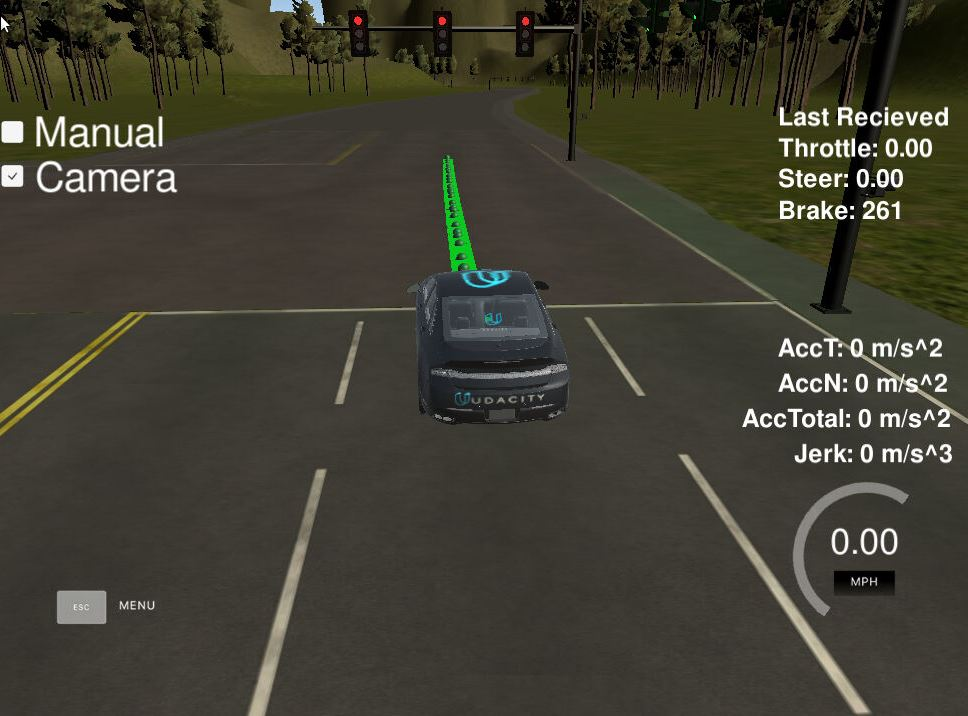
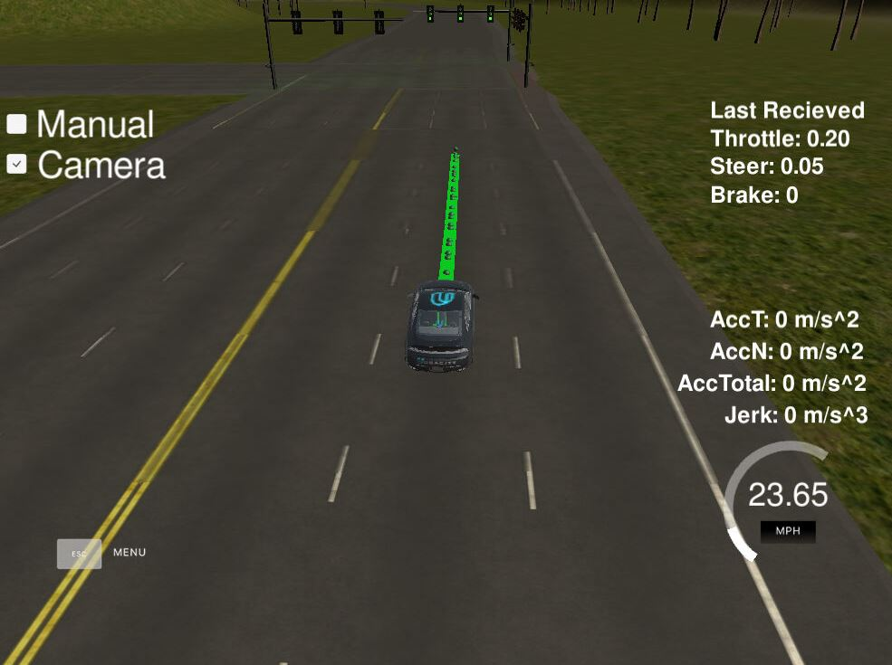
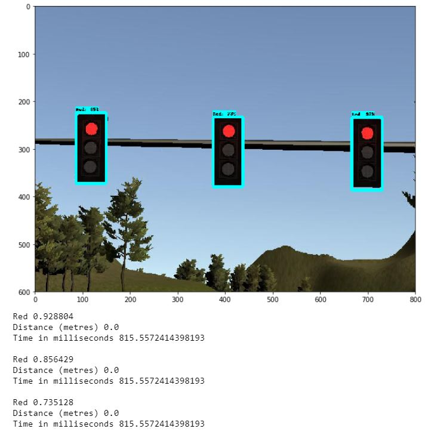
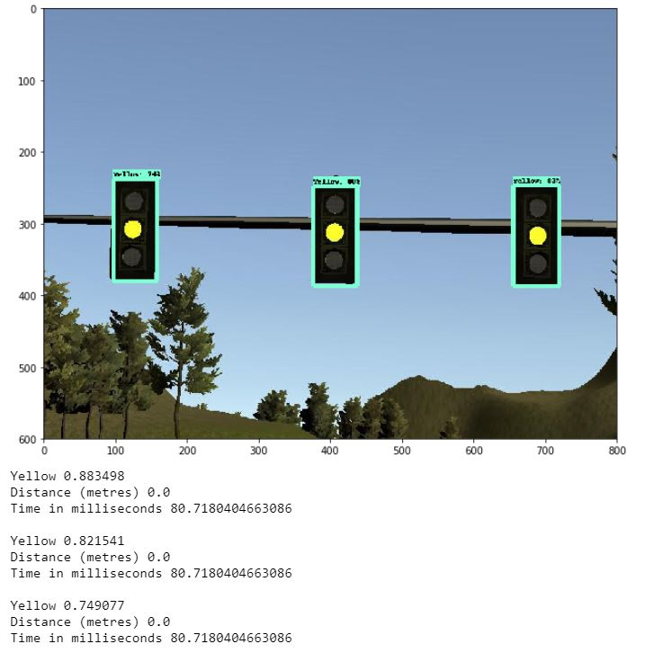
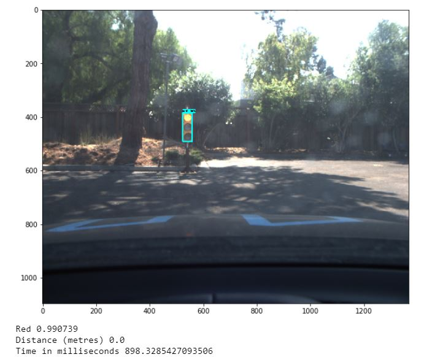

# CarND-Capstone Project

[](http://www.udacity.com/drive)

Overview
---

This is the final CarND-Capstone of the Udacity Self-Driving Car Nanodegree: Programming a Real Self-Driving Car. This is Ying Li, Hardware Engineer for Self Driving Car SOC Chip and GPU at Nvidia, email: <zoe.liying@gmail.com>. Due to schedule limitations, I worked on my own. 

Architecture 
---
The ROS nodes and topics are described in the diagram below. 
 

Waypoint Updater 
---
Waypoint Updater node publishes waypoint from the car's current position to LOOKAHED\_WPS ahead. 

It subscribes topics of 'current\_pose' and 'base\_way\_point'. I use **KDTree** to find the closest waypoint index in front of current car position, and then generate lane with the waypoints from closest waypoint to LOOKAHED\_WPS ahead. The simulator shows the path with a green lane. I originally set LOOKAHED\_WPS = 200, and found the car diverged to right. Then I set **LOOKAHED\_WPS = 30**, the car then follows the central lane without problem. 

Later on, after the **traffic lights** are detected and the stopline waypoint index and vecolcity are subscribed, the **decelerated waypoints** lane is re-generated by decreasing the waypoint speed when it gets closer to the stopline. The car would stop at *(stopline - car_length)*, whenever a red light is present. 


DBW node with Twist Controller
---
The DBW node is a drive-by-wire system. It controls throttle, brake, and steering electronically based on target linear and angular velocity, and other car properties, when DBW is enabled. 

The **throttle** control uses a default **PID** controller with (kp = 0.3, ki =0.1, kd =0). The velocity is also smoothed by a low-pass filter. 

The **steering** control uses a **Yaw Controller** based on its current velocity and target velocity and angle. 

The **brake** control uses a direct deceleration by applying a Torque based on its mass and wheel radius. 

The update rate for Waypoint Updater and DBW node can be set between **10 to 30Hz**. It might be set at low end when camera is on or in real system.

Waypoint Follower
---
The waypoint follower uses Autoware which subscribes the final waypoints from waypoint updater and publishes the **twist command** (target linear and angular velocity) to DBW node. 

The only change is made to **pure\_pursuit_core.cpp calcTwist** function. The function originally updated the twist command only when the car is not following the path. It might cause the car to wander when the update rate is low. It is changed to constantly computing latest angular velocity by current speed and the lane curvature. 

Traffic Light Detector
---
The traffic light detector subscribes the camera images and published the traffic light **stopline waypoint index** to **Waypoint Updater**. **KDTree** was also used here to find the closest waypoint before the closest light and its state color. If red state was detected **STATE_COUNT_THRESHOLD = 2** times, then its stopline index was published. Green and yellow traffic lights are ignored. I firstly use the foreknown traffic light info to validate my waypoint updater with traffic light detector behavior. The car stopped at each red light safely before the stopline, and passed the green light with target speed. 




Traffic Light Classification 
--- 
Traffic lights are classified with transfer learning on a TensorFlow model **[SSD Inception V2 Coco]**(http://download.tensorflow.org/models/object_detection/ssd_inception_v2_coco_2018_01_28.tar.gz). More options of models are available at [Tensorflow detection model zoo](https://github.com/tensorflow/models/blob/master/research/object_detection/g3doc/detection_model_zoo.md). The training process are conducted on two **separated image datasets**: Udacity highway simulator dataset and site lot. 

Image capture and labeling work can be quite lengthy. Due to the limited time, I leveraged the existing labeled dataset from *[Vatsal Srivastava](https://github.com/coldKnight/TrafficLight_Detection-TensorFlowAPI#get-the-dataset) and [Alexander Lechner](https://github.com/alex-lechner/Traffic-Light-Classification#1-the-lazy-approach)*. 

The inference jupyter notebook can be found [here](https://github.com/zoespot/CarND-Capstone/blob/master/ros/src/tl_detector/light_classification/tl_inference.ipynb). The results showed the light are correctly classified. 

 



  

The frozen models are saved at the *ros/src/tl\_detector/light\_classification/model*. 

Environment Setup & Run 
---
First, I use native installation by setting up VMbox with Ubuntu 16.04 ROS Kinect and Dataspeed DBW. In order to improve display and enable copy/paste between virtualbox and local machine, I then installed Guest Addition. It's a little tricky as the ISO can't be mounted directly. I followed instructions [here](https://askubuntu.com/questions/321589/unable-to-mount-the-cd-dvd-image-on-the-machine-sandbox) with a local copy of [installation iso](https://download.virtualbox.org/virtualbox/6.0.4/).

Launch files are parameterized for simulator and site lot situations with different *traffic light classification model*, *state count threashold* and *DBW and Waypoint update rate*.

Run the simulator:
```bash
cd ros
catkin_make
source devel/setup.sh
roslaunch launch/styx.launch
```
Real world testing:

```bash
roscore
rosbag play -l traffic_light_bag_file/traffic_light_training.bag
```
```bash
cd CarND-Capstone/ros
roslaunch launch/site.launch
```
In Udacity workspace **Desktop** use rviz.
